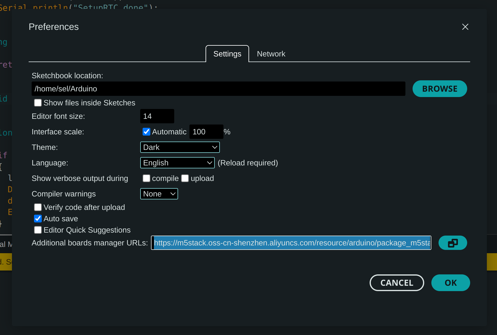

# Air quality sersors (M5stack)
This repository contains the source code to replicate air quality sensors based on M5Stack technology. the sensor collects data about temperature, humidity and CO2 and send it via LoRaWAN useing the LoRaWAN@NOI.

# IoT device

We are using the follow devices:

- [M5Stack U103 unit](https://www.digikey.it/it/products/detail/m5stack-technology-co-ltd/U103/17372277)
- [M5Stack Atom RGB Matrix](https://docs.m5stack.com/en/core/ATOM%20Matrix)

and

- [M5StickC Plus](https://shop.m5stack.com/products/m5stickc-plus-esp32-pico-mini-iot-development-kit?variant=43983456764161)
- [M5Stack U117 unit](https://www.distrelec.it/it/unita-di-comunicazione-lorawan-asr6501-868-mhz-con-antenna-m5stack-u117/p/30221929?cq_src=google_ads&cq_cmp=20275325649&cq_con=158849409348&cq_term=&cq_med=pla&cq_plac=&cq_net=g&cq_pos=&cq_plt=gp&gclid=CjwKCAiApaarBhB7EiwAYiMwqqtU14UVl2LdOgy6yO81JfiAQMOsymbNZalW4Yx46zLncQmVLvrIDBoCsOYQAvD_BwE&gclsrc=aw.ds)

# How it works

Basically the RGB Matrix reads the room status and displays a green or red color according to the room status.
The IoT device also reads the air quality data from the connected sensor (via GROVE connector) and send the data to the backend: the data is associated to the room on the on backend side.
If the CO2 value exceeds 1200ppm, the RGB Matrix starts to blink.

The other two IoT devies are used to read the air quality data from the backend and send it via LoraWAN (AT+ commanda).

# Compile the code with Arduino.

Please install the last Arduino IDE.\
Download libraries and products for the M5Stack devices:
https://m5stack.oss-cn-shenzhen.aliyuncs.com/resource/arduino/package_m5stack_index.json

# To know

If the IoT is not able to connect to the WiFi after some seconds, it reboots (check SSID and password)

In order to refresh the ePaper, the label restarts every 2 hours
